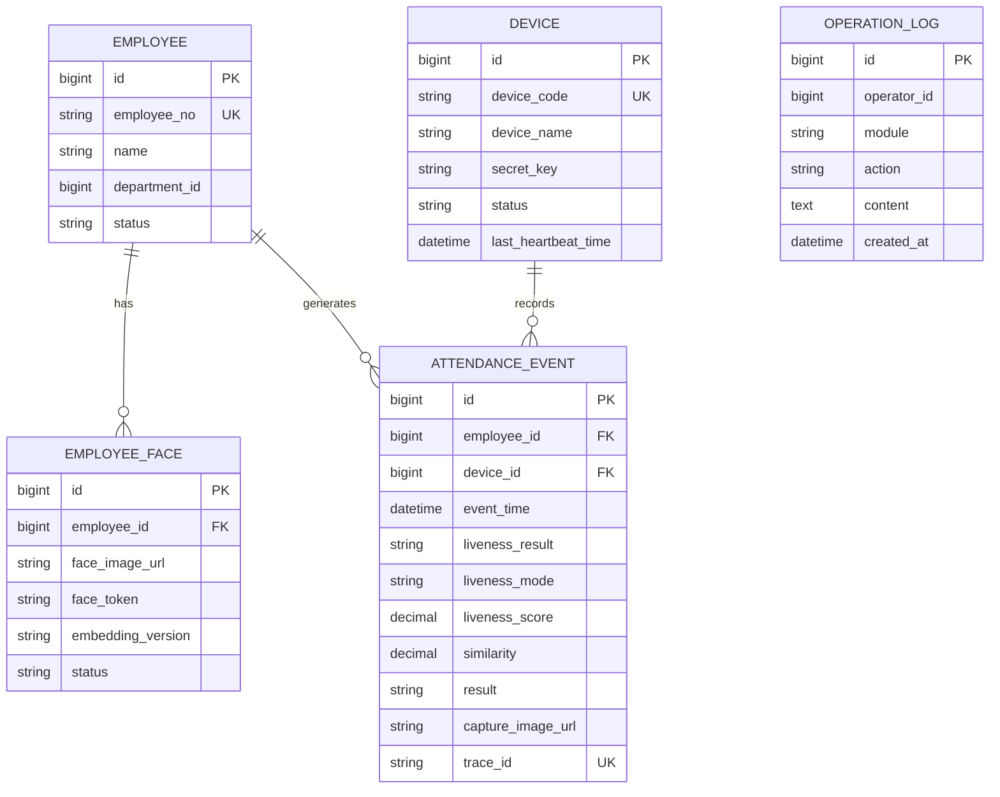

# 门禁人脸打卡系统 ER 图

## 1. 说明

- 本 ER 图基于当前 PRD 中已明确的数据实体输出，属于一期逻辑模型。
- 图中优先表达核心业务关系：员工、人脸模板、设备、打卡事件。
- `operation_log` 当前仅作为审计日志实体保留，因 PRD 尚未定义独立后台账号表，暂不强行绑定外键关系。

## 2. Mermaid ER 图

## 3. 实体关系说明

### 3.1 `employee` 与 `employee_face`

- 关系：一对多
- 说明：一个员工可维护多张人脸模板，便于后续支持多角度注册、模板更新与版本切换
- 外键：`employee_face.employee_id -> employee.id`

### 3.2 `employee` 与 `attendance_event`

- 关系：一对多
- 说明：一个员工会产生多条打卡事件
- 外键：`attendance_event.employee_id -> employee.id`

### 3.3 `device` 与 `attendance_event`

- 关系：一对多
- 说明：一台门禁设备会记录多条打卡事件
- 外键：`attendance_event.device_id -> device.id`

### 3.4 `operation_log`

- 关系：当前独立保留
- 说明：由于当前 PRD 尚未定义后台账号实体，例如 `admin_user` 或 `system_user`，因此 `operator_id` 暂不在 ER 图中建立明确外键
- 建议：如果下一步要做后台权限系统，建议补充 `system_user`、`role`、`permission` 三类实体，再将 `operation_log.operator_id` 与后台账号表关联

## 3.5 字段中文说明

### `employee`

- `id`：员工主键 ID
- `employee_no`：员工编号
- `name`：员工姓名
- `department_id`：所属部门 ID
- `status`：员工状态

### `employee_face`

- `id`：员工人脸记录主键 ID
- `employee_id`：关联员工 ID
- `face_image_url`：人脸图片地址或存储路径
- `face_token`：人脸模板唯一标识
- `embedding_version`：向量模型版本
- `status`：人脸模板状态

### `device`

- `id`：设备主键 ID
- `device_code`：设备编号
- `device_name`：设备名称
- `secret_key`：设备密钥
- `status`：设备状态
- `last_heartbeat_time`：最后心跳时间

### `attendance_event`

- `id`：打卡事件主键 ID
- `employee_id`：关联员工 ID
- `device_id`：关联设备 ID
- `event_time`：打卡时间
- `liveness_result`：活体检测结果
- `liveness_mode`：活体检测模式
- `liveness_score`：活体检测分值
- `similarity`：人脸相似度
- `result`：最终识别或打卡结果
- `capture_image_url`：抓拍图片地址
- `trace_id`：请求追踪号

### `operation_log`

- `id`：日志主键 ID
- `operator_id`：操作人 ID
- `module`：功能模块
- `action`：操作动作
- `content`：日志内容
- `created_at`：创建时间

## 4. 建表建议

### 4.1 主键建议

- 全表统一使用 `bigint` 主键
- 主键生成方式可选雪花算法、自增或分布式 ID

### 4.2 唯一键建议

- `employee.employee_no` 建议唯一
- `device.device_code` 建议唯一
- `attendance_event.trace_id` 建议唯一

### 4.3 索引建议

- `employee(employee_no)`
- `employee_face(employee_id, status)`
- `device(device_code, status)`
- `attendance_event(employee_id, event_time)`
- `attendance_event(device_id, event_time)`
- `attendance_event(trace_id)`
- `operation_log(created_at)`

## 5. 二期可扩展实体

- `department`
  - 若后续需要组织架构维护，建议将 `employee.department_id` 显式关联到部门表
- `system_user`
  - 用于后台管理员登录、权限、审计
- `role`
  - 用于角色授权
- `permission`
  - 用于接口与菜单权限控制
- `device_config`
  - 用于设备参数下发与版本管理

## 6. 当前结论

- 一期最小闭环 ER 核心实体为：`employee`、`employee_face`、`device`、`attendance_event`
- `operation_log` 已纳入模型，但建议在后台账号体系明确后再补完整外键关系
- 当前 ER 图已可直接作为下一步数据库 DDL 设计输入
