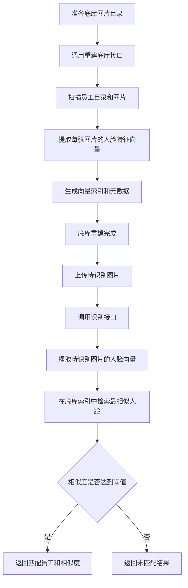

# 门禁人脸打卡系统 PRD

## 1. 文档信息

- 文档名称：门禁人脸打卡系统 PRD
- 文档版本：V1.0
- 编写日期：2026-07-02
- 适用阶段：一期立项 / 研发评审 / 实施准备
- 部署模式：纯内网部署

## 2. 项目背景

企业需要在老款安卓门禁机上部署一套内部员工扫脸打卡系统，替代传统刷卡或密码方式。系统需运行在局域网环境内，客户端采用 Java 原生 Android 开发，服务端管理能力采用 Java 开发，同时引入 Python 的人脸向量检索能力，实现员工人脸识别与实时打卡。

考虑到代打卡和翻拍攻击风险，一期必须加入基础活体检测能力。整体方案采用“静默活体优先，失败后动作活体降级”的策略，在保证老款设备可运行的前提下兼顾识别效率与基础防伪能力。

## 3. 产品目标

### 3.1 业务目标

- 建成一套面向内部员工的门禁扫脸打卡系统。
- 实现员工人脸注册、实时识别、打卡留痕的完整闭环。
- 降低代打卡和弱口令带来的管理风险。
- 在不依赖公网的前提下满足企业内网部署要求。

### 3.2 技术目标

- Android 门禁机端采用 Java 原生开发，兼容老款安卓系统。
- Java 服务端负责设备接入、业务管理、权限与审计。
- Python 服务负责活体检测、特征提取、向量检索与模型封装。
- 支持 `500-5000` 员工人脸库规模。
- 单次“活体 + 识别”端到端响应目标为 `1.5s - 2.5s`，上限不超过 `4s`。

## 4. 用户与角色

- 普通员工：在门禁机前扫脸完成打卡。
- 考勤管理员：维护员工档案、人脸底库、打卡记录。
- 系统管理员：维护设备、参数、权限、运行状态。

## 5. 一期范围

### 5.1 In Scope

- 门禁机 APK
  - 摄像头预览与抓拍
  - 人脸检测触发
  - 静默活体检测
  - 动作活体降级提示
  - 识别结果展示
  - 设备鉴权与心跳
- Java 管理服务
  - 员工管理
  - 人脸底库管理
  - 设备管理
  - 打卡事件管理
  - 审计日志
  - Python 服务编排调用
- Python 活体识别服务
  - 基础活体检测
  - 人脸特征提取
  - 向量入库与检索
  - 阈值判断
  - 统一识别结果输出
- 后台基础能力
  - 员工新增/导入/禁用
  - 人脸照片注册与更新
  - 打卡记录查询
  - 设备在线状态查看

### 5.2 Out of Scope

- 高强度活体检测
- 3D 深度活体
- 红外或双目硬件改造
- 自动开门控制联动
- 排班、迟到早退、复杂考勤规则
- 多租户和多园区统一调度
- 外网访问能力
- BI 统计报表

## 6. 关键业务规则

- 仅内部员工可使用扫脸打卡。
- 一期按“进出即打卡”处理，每次活体和识别双通过即生成一条事件记录。
- 打卡必须实时在线完成，不接受离线补传作为有效主链路。
- 活体失败直接拒绝，不生成有效打卡事件。
- 识别失败、员工禁用、人脸模板缺失、相似度低于阈值时均视为失败。
- 后台需完整记录设备、时间、员工、活体结果、识别结果、追踪号。

## 7. 总体方案

### 7.1 架构分层

- Android 门禁机 APK
  - 负责摄像头采集、界面交互、活体引导、结果展示、设备态控制
- Java 管理服务
  - 负责设备接入、请求鉴权、员工与人脸管理、打卡落库、权限与审计
- Python 活体识别服务
  - 负责活体检测、人脸特征提取、向量检索、阈值比对
- MySQL
  - 存储员工、设备、打卡记录、操作日志
- 文件存储
  - 存储注册人脸原图和必要抓拍留档
- 向量索引
  - 首期建议采用 `FAISS`

### 7.2 推荐技术栈

- Android：Java + Camera2，低版本设备可兼容 Camera API
- Java 服务：Spring Boot
- Python 服务：FastAPI 或 Flask
- 向量库：FAISS
- 数据库：MySQL 8.x

### 7.3 方案选择说明

- 不建议门禁机端本地做完整向量比对
  - 老款设备性能与兼容性风险较高
  - 模型升级与底库同步成本高
  - APK 包体积和内存占用不可控
- 建议由 Java 统一承接业务主控
  - 更适合权限、设备、员工、日志、审计等基础管理能力
- 建议由 Python 承接活体与向量检索
  - 更适合算法模型接入和向量检索实现

## 8. 业务流程

### 8.1 员工注册流程

1. 管理员创建员工档案。
2. 上传员工人脸照片或现场采集正脸照。
3. Java 服务调用 Python 服务做照片质量校验与特征提取。
4. Python 服务将向量写入索引并返回 `faceToken`、`embeddingVersion`。
5. Java 服务保存员工与人脸模板映射关系。

### 8.2 扫脸打卡流程

1. 门禁机检测到人脸，进入静默活体阶段。
2. 若静默活体置信度不足，门禁机提示用户执行眨眼或轻微摇头动作。
3. 门禁机采集抓拍图和活体帧，提交至 Java 服务。
4. Java 服务校验设备身份、记录审计、转发至 Python 服务。
5. Python 服务先做活体检测，再做特征提取与向量检索。
6. Java 服务根据活体结果、识别结果、员工状态、阈值策略做联合判定。
7. 双通过则生成打卡事件并返回员工信息。
8. 任一失败则返回失败原因，不生成有效打卡事件。

### 8.2.1 Demo 重建底库与识别流程图



- 说明：
  - “重建底库”负责把原始人脸图片转换成可检索的向量索引。
  - “识别”负责把待测图片转换成向量，再去底库索引中查找最相似员工。
  - 若底库图片发生新增、删除或替换，需先重新执行一次“重建底库”，识别结果才会同步更新。

### 8.3 设备管理流程

1. 设备首次入网登记，分配 `deviceCode` 与密钥。
2. 设备启动后完成鉴权登录。
3. 设备按固定周期上报心跳。
4. 服务端更新在线状态并返回基础配置。

## 9. 功能需求

### 9.1 门禁机 APK

#### 9.1.1 页面形态

- 单页扫脸界面
- 支持横屏或竖屏
- 大字显示识别结果
- 预留语音播报开关

#### 9.1.2 功能清单

- 开机自启
- 前台常驻
- 摄像头预览
- 人脸进入框自动抓拍
- 静默活体检测
- 动作活体引导
- 结果成功/失败反馈
- 重复提交抑制
- 设备登录
- 心跳上报
- 参数拉取
- 网络异常提示

#### 9.1.3 约束

- 不在本地持久化长期敏感图片
- 服务端未返回成功前，不记为有效打卡
- 端侧只做轻量交互控制，不承载重型识别模型

### 9.2 Java 管理服务

#### 9.2.1 员工管理

- 员工新增、编辑、禁用
- 员工编号、姓名、部门等基础信息维护

#### 9.2.2 人脸底库管理

- 上传注册照片
- 查看注册状态
- 更新人脸模板
- 删除失效人脸模板

#### 9.2.3 设备管理

- 设备注册
- 设备启停状态查看
- 在线状态展示
- 设备参数下发预留

#### 9.2.4 打卡事件管理

- 按时间、员工、设备查询
- 查看活体结果、识别分数、失败原因
- 导出能力预留

#### 9.2.5 安全与审计

- 设备鉴权
- 操作日志
- 接口调用日志
- 失败原因分类记录

### 9.3 Python 活体识别服务

- 静默活体检测
- 动作活体验证
- 人脸特征提取
- 向量索引管理
- 向量检索
- 阈值判断
- 模型版本输出
- 统一识别结果返回

## 10. 接口概览

### 10.1 Android -> Java

- `POST /api/device/auth/login`
  - 设备登录鉴权
- `POST /api/device/heartbeat`
  - 设备心跳
- `GET /api/device/config`
  - 获取设备配置
- `POST /api/device/face/recognize`
  - 上传抓拍图和活体帧，触发活体与识别

### 10.2 Java -> Python

- `POST /internal/face/register`
  - 注册员工向量
- `POST /internal/face/search`
  - 活体检测 + 人脸检索
- `POST /internal/face/delete`
  - 删除向量模板
- `GET /internal/model/version`
  - 查询模型版本

### 10.3 识别结果示例

```json
{
  "success": true,
  "employeeId": "E1024",
  "employeeName": "张三",
  "livenessResult": "PASS",
  "livenessMode": "SILENT",
  "livenessScore": 0.97,
  "similarity": 0.93,
  "threshold": 0.88,
  "recognizeResult": "MATCH",
  "traceId": "202607020001"
}
```

### 10.4 识别结果字段说明

- `success`：接口调用是否成功
- `employeeId`：匹配到的员工唯一标识
- `employeeName`：匹配到的员工姓名
- `livenessResult`：活体检测结果，例如 `PASS` 或 `REJECT`
- `livenessMode`：活体检测模式，例如静默活体 `SILENT`
- `livenessScore`：活体检测得分
- `similarity`：人脸相似度得分
- `threshold`：当前识别阈值
- `recognizeResult`：识别结果，例如 `MATCH` 或 `NO_MATCH`
- `traceId`：本次识别请求的追踪号，用于日志排查和审计

## 11. 数据模型建议

### 11.1 employee

- `id`：员工主键 ID
- `employee_no`：员工编号，业务唯一
- `name`：员工姓名
- `department_id`：所属部门 ID
- `status`：员工状态，例如启用、禁用

### 11.2 employee_face

- `id`：员工人脸记录主键 ID
- `employee_id`：关联的员工 ID
- `face_image_url`：人脸原始图片地址或存储路径
- `face_token`：人脸模板唯一标识
- `embedding_version`：向量模型版本号
- `status`：人脸模板状态，例如有效、停用

### 11.3 device

- `id`：设备主键 ID
- `device_code`：设备编号，业务唯一
- `device_name`：设备名称
- `secret_key`：设备鉴权密钥
- `status`：设备状态，例如启用、停用、离线
- `last_heartbeat_time`：最近一次心跳时间

### 11.4 attendance_event

- `id`：打卡事件主键 ID
- `employee_id`：关联员工 ID
- `device_id`：关联设备 ID
- `event_time`：打卡事件发生时间
- `liveness_result`：活体检测结果
- `liveness_mode`：活体检测模式
- `liveness_score`：活体检测得分
- `similarity`：识别相似度得分
- `result`：最终打卡结果，例如成功、失败
- `capture_image_url`：抓拍图片地址或存储路径
- `trace_id`：识别链路追踪号

### 11.5 operation_log

- `id`：操作日志主键 ID
- `operator_id`：操作人 ID
- `module`：所属功能模块
- `action`：执行动作，例如新增、修改、删除
- `content`：操作内容明细
- `created_at`：日志创建时间

## 12. 非功能需求

### 12.1 性能

- 支持 `500-5000` 员工规模
- 单次“活体 + 识别”端到端响应目标 `1.5s - 2.5s`
- 最长响应不超过 `4s`

### 12.2 可用性

- 支持纯内网部署
- 支持单机部署并可扩展
- 活体失败、识别失败必须可追溯

### 12.3 安全

- 设备与服务端进行鉴权
- 人脸原图、向量、业务数据分层管理
- 预留加密存储与脱敏策略
- 为后续等保改造预留扩展位

### 12.4 兼容性

- Android 优先兼容 `5-9`
- 尽量不依赖 Google 服务

## 13. 风险与约束

- 设备硬件能力尚未确认
  - 需尽快确认 CPU、RAM、摄像头像素、系统版本、厂商限制
- 网络强依赖
  - 实时在线模式会直接受局域网质量影响
- 基础活体能力有限
  - 对高仿面具、复杂视频攻击防护有限
- 采集质量影响效果
  - 光照、姿态、逆光会影响活体与识别准确率

## 14. 验收标准

- 员工人脸注册后，可在门禁机完成扫脸打卡
- 活体和识别双通过时，后台生成有效打卡事件
- 活体失败、识别失败、禁用员工、缺失模板均不生成有效记录
- 后台可按员工、时间、设备查询打卡记录
- 后台可查看设备在线状态

## 15. 里程碑建议

- 里程碑 1：确认设备参数、网络环境、部署边界
- 里程碑 2：完成 PRD、接口草案、数据模型
- 里程碑 3：完成 Python 活体与识别服务原型
- 里程碑 4：完成 Java 业务服务原型
- 里程碑 5：完成 Android APK 原型与三端联调
- 里程碑 6：完成阈值调优、压测和上线准备

## 16. 研发落地建议

- 优先验证老款门禁机摄像头能力与帧率
- 优先完成 Python 活体与识别基线测试
- Java 服务优先落员工、人脸、设备、打卡四类核心实体
- Android 端先完成最小闭环，再优化 UI 与交互
